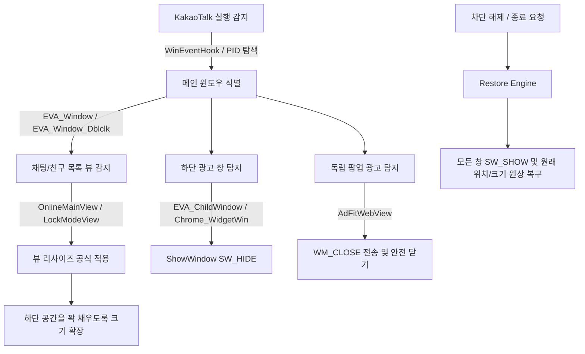

# 💬 KakaoTalk Layout AdBlocker v11 (Rust Native)

[-0078D6?logo=windows)](https://github.com/twbeatles/kakaotalk-pc-adblock-rust/releases)
[](https://www.rust-lang.org/)
[](LICENSE)
[](#-안전한-순수-레이아웃-차단-layout-only)

**Windows PC용 카카오톡 레이아웃 기반 무해한 광고 차단기**입니다.

기존 Python 기반 런타임에서 **순수 Rust 네이티브(`kakao-adblock-rs`) 단일 바이너리로 전면 재작성**되어, Python 설치나 별도 의존성 없이 극도로 가볍고 빠르며 안전하게 동작합니다.

`hosts` 파일 수정, DNS 캐시 변조, AdFit 레지스트리 조작, 네트워크 패킷 감청을 **전혀 하지 않고**, 순수 **Win32 레이아웃 조정 및 광고 창 은닉**만으로 동작합니다. 관리자 권한(UAC)이 필요 없으며, 카카오톡 업데이트나 시스템 환경에 완벽히 안전합니다.

---

## 📑 목차

- [✨ 핵심 특징 (Key Highlights)](#-핵심-특징-key-highlights)
- [🦀 Rust 네이티브 개편 안내 (v11.1.0)](#-rust-네이티브-개편-안내-v1110)
- [🚀 빠른 시작 (3단계 사용법)](#-빠른-시작-3단계-사용법)
- [🖥️ 시스템 트레이 사용 가이드](#️-시스템-트레이-사용-가이드)
- [🧠 동작 원리 (Layout-Only 차단)](#-동작-원리-layout-only-차단)
- [⌨️ CLI 명령줄 옵션 및 진단 도구](#️-cli-명령줄-옵션-및-진단-도구)
- [⚙️ 설정 및 규칙 커스터마이징](#️-설정-및-규칙-커스터마이징)
- [❓ 자주 묻는 질문 및 문제 해결 (FAQ)](#-자주-묻는-질문-및-문제-해결-faq)
- [🛠️ 개발 및 빌드 가이드 (For Developers)](#️-개발-및-빌드-가이드-for-developers)
- [📜 라이선스 및 크레딧](#-라이선스-및-크레딧)

---

## ✨ 핵심 특징 (Key Highlights)

- 🛡️ **안전한 순수 레이아웃 차단 (Layout-Only)**
  - 시스템 네트워크, DNS, hosts, 레지스트리를 건드리지 않아 PC 보안에 아무런 부작용이 없습니다.
  - 일반 사용자 권한(Non-UAC)으로 구동되며, 카카오톡 내부 메모리를 후킹하거나 패치하지 않습니다.
- ⚡ **Rust 네이티브 초경량 & 초저지연 성능**
  - 가벼운 단일 바이너리로 메모리 사용량(~수 MB)과 유휴 CPU 점유율(0%)을 극적으로 낮췄습니다.
  - `SetWinEventHook` 기반 실시간 윈도우 이벤트 반응과 적응형 폴링(50ms/200ms)이 결합되어 카카오톡 창 생성 시 딜레이 없이 즉각 광고를 제거합니다.
- 🔄 **완벽하고 깔끔한 상태 복원 (Clean Restoration)**
  - 트레이 메뉴에서 차단을 끄거나(OFF) 프로그램을 종료하면, 이전에 숨겨지거나 리사이즈된 카카오톡 창이 100% 원래 상태로 원복됩니다.
- 🎯 **최신 카카오톡 UI 완벽 대응**
  - 친구 목록 하단 배너, 피드 뷰, 잠금 모드 뷰, 독립 팝업형 광고(`AdFitWebView`)를 정확하게 식별하여 차단합니다.
- 🔔 **시스템 트레이 상주 및 원클릭 제어**
  - 복잡한 창 없이 시스템 트레이(시계 옆) 아이콘 우클릭만으로 모든 기능(차단 토글, 공격 모드, 시작프로그램, 자동 업데이트)을 원클릭 제어할 수 있습니다.
- 🔒 **Ed25519 전자 서명 기반 자동 업데이트**
  - 원클릭으로 공식 릴리스의 Ed25519 서명과 SHA-256 해시를 검증하여 최신 버전으로 안전하게 자체 교체 및 재시작합니다.

---

## 🦀 Rust 네이티브 개편 안내 (v11.1.0)

v11.1.0부터 프로그램의 핵심 코어가 **Python에서 순수 Rust로 전면 재구축**되었습니다.

| 구분 | 이전 (Python v11 / PyInstaller) | 개편 후 (Rust v11.1.0 네이티브) |
| :--- | :--- | :--- |
| **런타임 의존성** | Python 인터프리터 임베딩 + Tkinter | **0 (순수 Win32 네이티브 API 바이너리)** |
| **메모리 점유율** | 약 30MB ~ 60MB | **약 3MB ~ 8MB (최대 90% 절감)** |
| **시작 속도** | Python 언패킹 및 초기화로 수 초 소요 | **클릭 즉시 실행 (Sub-second)** |
| **윈도우 감지** | 타이머 기반 반복 폴링 중심 | **`SetWinEventHook` 실시간 훅 + 적응형 폴링** |
| **UI 방식** | 무거운 Tkinter GUI 설정창 | **경량 Win32 네이티브 트레이 메뉴** |
| **단일 실행 보장** | 프로세스 스캔 및 파일 락 | **Windows 커널 Named Mutex 싱글톤 가드** |
| **아키텍처** | 단일 스크립트 모듈 | **3-Tier 크레이트 분리 (`core`, `win32`, `app`)** |

> [!NOTE]
> 이전 Python v11 구현체는 회귀 검증 및 골든 패리티(Golden Parity) 비교용 레퍼런스로 [`legacy/python-v11/`](legacy/python-v11/)에 안전하게 보존되어 있습니다.

---

## 🚀 빠른 시작 (3단계 사용법)

### 1단계: 실행 파일 다운로드
[GitHub Releases](https://github.com/twbeatles/kakaotalk-pc-adblock-rust/releases)에서 최신 버전의 **`KakaoTalkLayoutAdBlocker_v11.exe`**를 다운로드합니다.
> 권장 위치: `C:\Tools\KakaoTalkAdBlocker\` 등 로컬 드라이브의 안정적인 폴더에 배치합니다. (바탕화면의 OneDrive 동기화 폴더 제외 권장)

### 2단계: 실행
다운로드한 `KakaoTalkLayoutAdBlocker_v11.exe`를 더블클릭하여 실행합니다.
- 관리자 권한을 묻는 UAC 창이 뜨지 않습니다.
- 실행 즉시 작업표시줄 알림 영역(트레이)에 **노란색 방패 아이콘**이 표시되며, 실행 중인 카카오톡의 광고가 즉시 사라집니다.

### 3단계: 부팅 시 자동 시작 등록 (선택)
트레이 아이콘을 우클릭한 후 **`시작프로그램 등록`**을 클릭하면 PC를 켤 때마다 자동으로 백그라운드 실행됩니다.

---

## 🖥️ 시스템 트레이 사용 가이드

작업표시줄 알림 영역(시계 옆)의 아이콘을 **우클릭**하면 직관적인 Win32 네이티브 팝업 메뉴가 나타납니다.

```text
  KakaoTalk Layout AdBlocker   ← (헤더)
  --------------------------
  차단 끄기 / 차단 켜기         ← [원클릭 토글] 광고 차단 활성화/비활성화 (원복)
✓ 공격 모드                    ← [고급] 광고 키워드 토큰 기반 심화 차단
✓ 시작프로그램 등록             ← Windows 로그인 시 자동 실행 등록
  복원 실패 초기화              ← 윈도우 원복 실패 카운터 리셋
  --------------------------
  로그 폴더 열기                ← 설정 파일 및 로그 디렉터리 탐색기 열기
  GitHub 릴리스 열기            ← 최신 버전 릴리스 웹페이지 열기
  업데이트 확인                 ← Ed25519 서명 검증 원클릭 자동 업데이트
  --------------------------
  종료                         ← 모든 카카오톡 창을 원상 복구한 뒤 안전 종료
```

### 메뉴별 기능 상세 설명

1. **차단 끄기 / 차단 켜기**
   - 차단을 끄면(`차단 끄기`) 프로그램이 종료되지 않은 상태에서도 숨겨진 광고 창이 즉시 다시 나타나며 원래 레이아웃으로 완벽 복원됩니다.
   - 언제든지 `차단 켜기`를 눌러 다시 광고를 차단할 수 있습니다.
2. **공격 모드 (Aggressive Mode)**
   - 기본 윈도우 시그니처 외에도 창 하위 요소 중 광고 토큰(`Ad`, `AdFit`, `광고` 등)이 포함된 요소를 추가로 식별하여 차단합니다. (기본값: **활성화**)
3. **시작프로그램 등록**
   - 체크 시 Windows 레지스트리(`HKCU\Software\Microsoft\Windows\CurrentVersion\Run`)에 `--startup-launch --minimized` 인자로 등록되어 부팅 시 화면 깜빡임 없이 트레이로 바로 시작됩니다.
4. **복원 실패 초기화**
   - 카카오톡 비정상 종료 등으로 발생할 수 있는 창 원복 재시도 큐를 수동으로 초기화합니다.
5. **로그 폴더 열기**
   - 설정 파일(`layout_settings_v11.json`, `layout_rules_v11.json`)과 로그 파일이 저장된 `%APPDATA%\KakaoTalkAdBlockerLayout\` 폴더를 파일 탐색기로 바로 열어줍니다.
6. **업데이트 확인**
   - 최신 릴리스 메타데이터를 조회하여 새 버전이 있을 경우 Ed25519 공개키 서명과 해시를 검증하고 원클릭으로 안전하게 업데이트 및 재시작합니다.
7. **종료**
   - 숨겨졌거나 리사이즈된 모든 카카오톡 창을 **원래 크기와 상태로 100% 되돌려 놓은 후** 안전하게 프로세스를 종료합니다.

---

## 🧠 동작 원리 (Layout-Only 차단)

본 프로그램은 카카오톡 내부 코드를 조작하거나 네트워크를 가로채지 않고, 순수 Windows API를 사용하여 레이아웃을 최적화합니다.



### 1. 뷰 리사이즈 공식
카카오톡 메인 창 내에서 하단 광고 영역을 덮고 메인 뷰를 확장하는 공식입니다:
- **`OnlineMainView*` (기본 메인 뷰)**:
  - `너비 = 부모 창 너비 - 2px`
  - `높이 = 부모 창 높이 - 31px`
- **`LockModeView*` (잠금 모드 뷰)**:
  - `너비 = 부모 창 너비 - 2px`
  - `높이 = 부모 창 높이`

### 2. 하단 배너 및 독립 팝업 처리
- 친구 목록 하단에 노출되는 `EVA_ChildWindow` 및 배너 패널을 `SWP_NOMOVE | SWP_NOZORDER | SWP_NOACTIVATE` 플래그로 z-order 부작용 없이 깔끔하게 은닉합니다.
- 카카오톡에 종속되어 뜨는 `AdFitWebView` 팝업 광고는 `SendMessageTimeoutW`로 안전하게 `WM_CLOSE`를 전송하여 프로세스 행(Hang) 없이 닫습니다.

### 3. 실시간 이벤트 감지 및 적응형 폴링 (Adaptive Polling)
- **`SetWinEventHook`**: 윈도우 생성(`EVENT_OBJECT_CREATE`), 표시(`EVENT_OBJECT_SHOW`), 활성화(`EVENT_SYSTEM_FOREGROUND`)를 커널 레벨에서 즉각 수신하여 카카오톡이 켜지는 순간 0.01초 내로 반응합니다.
- **적응형 폴링**: 카카오톡이 활성 상태일 때는 `50ms`, 유휴 상태일 때는 `200ms`로 자동 전환되어 배터리와 CPU 사용량을 획기적으로 아낍니다.

---

## ⌨️ CLI 명령줄 옵션 및 진단 도구

일반적인 실행 외에도 문제 진단 및 개발/디버깅을 위한 풍부한 CLI 플래그를 지원합니다.

```powershell
# 기본 실행 (트레이 상주)
KakaoTalkLayoutAdBlocker_v11.exe

# 백그라운드 조용히 시작
KakaoTalkLayoutAdBlocker_v11.exe --minimized

# [진단] 섀도우 모드 (창을 실제로 숨기지 않고 탐지 판정만 시뮬레이션)
KakaoTalkLayoutAdBlocker_v11.exe --shadow

# [진단] 환경 자가 진단 (레지스트리, 프로세스, 설정 파일 상태 점검)
KakaoTalkLayoutAdBlocker_v11.exe --self-check

# [진단] 자가 진단 결과를 JSON 형식으로 stdout 출력
KakaoTalkLayoutAdBlocker_v11.exe --self-check --json

# [진단] 현재 카카오톡 HWND 윈도우 계층 구조 덤프 (JSON 저장)
KakaoTalkLayoutAdBlocker_v11.exe --dump-tree

# [진단] 카카오톡 창 변화를 시간축으로 연속 덤프 (새 UI 대응 및 버그 제보용)
KakaoTalkLayoutAdBlocker_v11.exe --dump-tree-series --dump-series-duration-ms 2000 --dump-series-interval-ms 50

# [도구] 최신 버전 업데이트 유무 확인
KakaoTalkLayoutAdBlocker_v11.exe --check-update
```

### CLI 옵션 요약

| 옵션 | 설명 |
| :--- | :--- |
| `--minimized` | 화면 알림 없이 시스템 트레이로 바로 백그라운드 시작합니다. |
| `--shadow` | **시뮬레이션 모드**. 창을 숨기거나 닫지 않고 탐지된 메인 창 및 광고 후보 목록만 표준 출력합니다. |
| `--self-check` | 엔진을 실행하지 않고 시스템 권한, 프로세스 탐색, 설정 파일 무결성을 진단합니다. |
| `--json` | 진단 결과를 정형화된 JSON 포맷으로 출력합니다. |
| `--dump-tree` | 현재 카카오톡의 윈도우 계층 구조를 JSON 파일로 저장합니다. |
| `--dump-tree-series` | 지정된 시간 동안 연속으로 윈도우 프레임과 광고 후보 판정 결과를 기록합니다. |
| `--dump-dir <path>` | 덤프 파일이 저장될 디렉터리를 지정합니다. (기본값: `%APPDATA%\...`) |
| `--dump-series-duration-ms <ms>` | 연속 덤프 수집 총 시간 (기본값: 1000, 최대: 10000). |
| `--dump-series-interval-ms <ms>` | 연속 덤프 수집 간격 (기본값: 100, 최소: 10). |
| `--check-update` | 원격 릴리스 서버와 통신하여 업데이트 가능 여부를 확인합니다. |

> [!TIP]
> `--self-check`, `--shadow`, `--dump-tree` 등의 진단 명령은 기존 실행 중인 프로세스의 Mutex를 방해하지 않으므로 백그라운드 실행 중에도 언제든 별도로 실행하여 결과를 확인할 수 있습니다.

---

## ⚙️ 설정 및 규칙 커스터마이징

### 설정 파일 위치
- 📁 **저장 경로**: `%APPDATA%\KakaoTalkAdBlockerLayout\`
  - `layout_settings_v11.json` : 동작 주기 및 기능 설정
  - `layout_rules_v11.json` : 광고 윈도우 식별 클래스 및 레이아웃 규칙
  - `layout_adblock.log` : 프로그램 동작 로그 파일

트레이 메뉴의 **[로그 폴더 열기]**를 클릭하면 해당 폴더가 즉시 열립니다.

### layout_settings_v11.json (동작 및 성능 설정)

```json
{
  "enabled": true,
  "run_on_startup": false,
  "start_minimized": true,
  "poll_interval_ms": 50,
  "idle_poll_interval_ms": 200,
  "pid_scan_interval_ms": 200,
  "cache_cleanup_interval_ms": 1000,
  "burst_scan_iterations": 3,
  "burst_scan_interval_ms": 20,
  "aggressive_mode": true,
  "log_level": "INFO"
}
```

- `poll_interval_ms`: 카카오톡 활성 상태에서의 탐지 주기 (기본값: `50ms`)
- `idle_poll_interval_ms`: 카카오톡 유휴 상태에서의 탐지 주기 (기본값: `200ms`)
- `aggressive_mode`: 광고 키워드 토큰 기반 심화 탐지 모드 여부
- `burst_scan_iterations` / `burst_scan_interval_ms`: 창 포커스 변화 시 순간 버스트 스캔 설정

### layout_rules_v11.json (광고 필터링 규칙)
카카오톡의 내부 윈도우 클래스명이 변경되더라도 바이너리 재빌드 없이 JSON 규칙 수정만으로 유연하게 대응할 수 있습니다.

```json
{
  "main_window_classes": ["EVA_Window_Dblclk", "EVA_Window"],
  "ad_candidate_classes": ["EVA_Window_Dblclk", "EVA_Window"],
  "main_window_titles": ["카카오톡", "KakaoTalk"],
  "main_view_prefix": "OnlineMainView",
  "lock_view_prefix": "LockModeView",
  "eva_child_class": "EVA_ChildWindow",
  "popup_ad_classes": ["AdFitWebView"],
  "aggressive_ad_tokens": ["Ad", "AdFit", "Advertisement", "광고"],
  "banner_min_height_px": 40,
  "banner_max_height_px": 260,
  "hide_bottom_banner_without_token": false,
  "close_empty_eva_child_requires_ad_signal": true
}
```

### 설정 파일 자동 복구 (Self-Healing)
- 설정 파일을 편집하다가 JSON 문법 오류를 내더라도 프로그램이 종료되지 않습니다.
- 손상된 파일은 `*.broken-YYYYMMDD-HHMMSS` 파일로 자동 백업되며, 정상 기본값으로 안전하게 자가 복구됩니다. 백업 파일은 30일 경과 시 자동 정리됩니다.

---

## ❓ 자주 묻는 질문 및 문제 해결 (FAQ)

### Q1. 트레이 아이콘이 보이지 않아요.
- **원인**: Windows 작업표시줄 설정에 의해 아이콘이 숨겨져 있을 수 있습니다.
- **해결**: 작업표시줄 우측 시계 옆의 `^` (숨겨진 아이콘 표시) 화살표를 누르고 노란색 방패 아이콘을 작업표시줄로 드래그하여 고정하세요.

### Q2. 카카오톡이 업데이트된 후 광고가 다시 나타나요.
- **원인**: 카카오톡 대규모 업데이트로 내부 윈도우 클래스 구조나 계층이 변경되었을 수 있습니다.
- **해결 및 제보 요령**:
  1. 광고가 노출된 상태에서 명령 프롬프트(CMD) 또는 PowerShell을 엽니다.
  2. 다음 명령어로 연속 덤프를 생성합니다:
     ```powershell
     KakaoTalkLayoutAdBlocker_v11.exe --dump-tree-series
     ```
  3. 콘솔에 출력된 경로의 `window_dump_series_*.json` 파일을 첨부하여 [GitHub Issues](https://github.com/twbeatles/kakaotalk-pc-adblock-rust/issues)에 제보해 주시면 빠르게 규칙이 업데이트됩니다.

### Q3. 여러 번 실행하면 중복으로 켜지나요?
- Windows Named Mutex(`Local\KakaoTalkLayoutAdBlocker_v11`)를 통해 **단일 인스턴스 실행**이 엄격히 보장됩니다. 이미 실행 중인 경우 추가 프로세스는 즉시 안전하게 종료(`exit 0`)됩니다.

### Q4. 백신 프로그램(Windows Defender 등)에서 오탐(False Positive)하나요?
- 관리자 권한을 요구하지 않고 시스템 영역을 전혀 건드리지 않는 순수 오픈소스 바이너리입니다. 만약 알 수 없는 게시자 경고(SmartScreen)가 뜬다면 **[추가 정보] -> [실행]**을 눌러 주시면 정상 동작합니다.

---

## 🛠️ 개발 및 빌드 가이드 (For Developers)

### 아키텍처 개요
저장소의 Rust 워크스페이스(`rust/`)는 단일 책임 원칙에 따라 3개의 크레이트로 분리되어 있습니다:

- **`crates/kakao-core`**:
  - Windows API에 의존하지 않는 순수 알고리즘 도메인.
  - 윈도우 트리 그래프 모델링, 레이아웃 수식 계산, 광고 시그널 평가.
  - Golden Parity 테스트를 통해 이전 Python 버전과 동일한 판정 결과를 내는지 검증.
- **`crates/kakao-win32`**:
  - `windows` 0.61 크레이트를 이용한 순수 Win32 API 추상화 계층.
  - `SetWinEventHook` 실시간 이벤트 훅, 단일 인스턴스 Mutex, 시작프로그램 레지스트리 관리.
  - Win32 네이티브 트레이 메뉴(`Shell_NotifyIconW`, `TrackPopupMenu`).
  - 테스트용 `FakeWin32` 목(Mock) 엔진 내장.
- **`crates/kakao-app`**:
  - 최종 릴리스 바이너리(`KakaoTalkLayoutAdBlocker_v11.exe`).
  - CLI 파서(`clap`), 백그라운드 엔진 워커 스레드 오케스트레이션, 설정 파일 관리.
  - Ed25519 서명 검증 기반 원클릭 업데이터.

### 빌드 환경 준비
- Windows 10 / 11 (64-bit)
- Rust Stable (`rustup default stable-x86_64-pc-windows-msvc`)

```powershell
# 저장소 클론
git clone https://github.com/twbeatles/kakaotalk-pc-adblock-rust.git
cd kakaotalk-pc-adblock-rust
```

### 빌드 및 로컬 실행
```powershell
cd rust
cargo run -p kakao-app --release
```

### 테스트 및 린트
```powershell
cd rust
# 전체 워크스페이스 단위/통합 테스트 (Golden Parity 포함)
cargo test --workspace

# Clippy 린트 검증
cargo clippy --all-targets --all-features -- -D warnings
```

### 릴리스 바이너리 패키징
루트의 배포 스크립트를 통해 아이콘 및 버전 정보가 리소스에 임베딩된 최종 EXE를 빌드할 수 있습니다:

```powershell
# 무서명 릴리스 빌드 (dist/KakaoTalkLayoutAdBlocker_v11.exe 생성 및 스모크 테스트 수행)
powershell -ExecutionPolicy Bypass -File .\scripts\build_release.ps1 -NoSign

# 인증서 서명을 포함한 릴리스 빌드
$env:SIGN_CERT_SHA1="YOUR_CERT_THUMBPRINT"
powershell -ExecutionPolicy Bypass -File .\scripts\build_release.ps1
```

---

## 📜 라이선스 및 크레딧

- **License**: 본 프로젝트는 [MIT License](LICENSE)를 따릅니다.
- **Reference**: 본 도구의 레이아웃 기반 차단 개념은 [blurfx/KakaoTalkAdBlock](https://github.com/blurfx/KakaoTalkAdBlock)의 접근법을 참고하여 시작되었으며, v11 이후 독립적인 Rust 네이티브 아키텍처로 완전히 재설계 및 고도화되었습니다.
